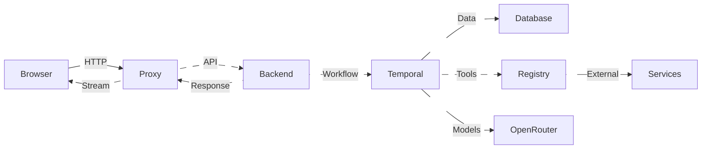

# Obelisk

> A modern, real-time chat application powered by Temporal workflows and OpenRouter's free AI models. Because why pay for AI when you can get it for free?

https://github.com/user-attachments/assets/f764d1b3-99bd-4ea4-a3f0-1284ecdfc1d9


## What is Obelisk?

Obelisk is a sophisticated chat application that combines the power of **Temporal workflows** with **OpenRouter's extensive collection of free AI models**. It features real-time streaming responses, dynamic tool calling, and model-agnostic sessions that let you switch between AI models mid-conversation.

## Architecture

Obelisk uses a **layered architecture** with a unique proxy setup that enables seamless streaming and session management:



### **Component Breakdown:**

- **Browser**: Vanilla JavaScript frontend with real-time streaming capabilities
- **Proxy**: FastAPI middleware layer that handles session management and API forwarding
- **Backend**: Core FastAPI service managing chat logic and workflow orchestration
- **Temporal**: Reliable, fault-tolerant chat processing with built-in retry mechanisms
- **Database**: SQLite for lightweight session and conversation persistence
- **Registry**: Dynamic tool system for extensible functionality
- **Services**: External APIs (weather, calculator, etc.) - only if tools/MCP requires
- **OpenRouter**: Free AI models provider

## Features

### **Free AI Models Galore**
- **OpenRouter Integration**: Access to dozens of free AI models including:
  - DeepSeek models
  - Mistral variants
  - Llama models
  - And many more!
- **Model Switching**: Change AI models mid-conversation without losing context

### **Dynamic Tool Calling**
- **Extensible Tool System**: Built-in calculator, weather tools, and more
- **Easy Tool Addition**: Simple plugin architecture for custom tools
- **Runtime Tool Discovery**: Tools are dynamically registered and executed

### **Real-time Experience**
- **Streaming Responses**: See AI responses as they're generated
- **Live Updates**: Real-time frontend updates using modern web technologies
- **Session Persistence**: Your conversations are saved and resumable

### **Robust Architecture**
- **Layered Design**: Browser UI → Proxy Layer → Backend API → Temporal Workflows
- **Streaming Pipeline**: Real-time data flow through multiple service layers
- **Session Management**: Intelligent proxy layer handles session persistence and model switching
- **Fault Tolerance**: Temporal workflows provide retry mechanisms and reliability

## Quick Start

### Prerequisites
- Python 3.8+
- [uv](https://docs.astral.sh/uv/) (recommended package manager)

### Installation

1. **Clone the repository**
   ```bash
   git clone https://github.com/yourusername/obelisk.git
   cd obelisk
   ```

2. **Install dependencies using uv**
   ```bash
   uv sync
   ```

3. **Set up environment variables**
   ```bash
   cp .env.example .env
   # Edit .env with your OpenRouter API key
   ```

4. **Initialize the database**
   ```bash
   uv run python -m src.database.manager
   ```

### Running the Application

1. **Start Temporal server** (in a separate terminal)
   ```bash
   ./scripts/start-temporal-local.sh
   ```

2. **Start the workers**
   ```bash
   uv run python -m src.temporal.workers.simple_chat_worker
   ```

3. **Start the backend API server**
   ```bash
   uv run python main.py
   ```

4. **Start the frontend proxy server**
   ```bash
   cd frontend
   uv run python app.py
   ```

## Usage

1. **Start a conversation**: Just type your message and hit send
2. **Switch models**: Use the dropdown to change AI models anytime
3. **Use tools**: Ask for calculations, weather, or other tool-based queries
4. **Resume sessions**: Your conversations are automatically saved

## Adding Custom Tools

```python
# src/tools/implementations/my_tool.py
from src.tools.base import BaseTool
from src.tools.schemas import ToolCall, ToolResult

class MyCustomTool(BaseTool):
    name = "my_custom_tool"
    description = "Does something awesome"
    
    def execute(self, call: ToolCall) -> ToolResult:
        # Your tool logic here
        return ToolResult(success=True, result="Awesome!")
```

## Roadmap

- [x] **Free models integration** with conversational chat via Temporal
- [x] **Model agnostic sessions** (switch models mid-conversation)
- [x] **Event streaming responses**
- [x] **Basic frontend** with streaming capabilities
- [x] **Tool calling** infrastructure
- [ ] **MCP servers** integration
- [ ] **Forced tool calls** (experimental)
- [ ] **RAG** for custom uploaded/scraped files
- [ ] **Context caching** for longer sessions
- [ ] **Multi-Agent system**
- [ ] **Dockerise** the whole thing for easier setup

## Contributing

Contributions are welcome! Please feel free to submit a Pull Request. For major changes, please open an issue first to discuss what you would like to change.

## License

This project is licensed under the MIT License - see the [LICENSE](LICENSE) file for details.

##  Acknowledgments

- [OpenRouter](https://openrouter.ai/) for providing free access to AI models
- [Temporal](https://temporal.io/) for the awesome workflow engine
- Cursor the goated code editor 😤.
- The open-source community for making this possible

---

*Built with ❤️, way too much caffeine and AI.* ☕
